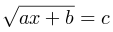

# D. Уравнение с корнем
|
:---|---:
Ограничение времени	|1 секунда
Ограничение памяти	|64Mb
Ввод	|стандартный ввод или input.txt
Вывод	|стандартный вывод или output.txt

Решите в целых числах уравнение:
,

_a, b, c_ – данные целые числа: найдите все решения или сообщите, что решений в целых числах нет.

## Формат ввода
Вводятся три числа a, b и c по одному в строке.

## Формат вывода
Программа должна вывести все решения уравнения в порядке возрастания, либо NO SOLUTION (заглавными буквами), если решений нет. 
Если решений бесконечно много, вывести MANY SOLUTIONS.

### Пример 1
Ввод	|Вывод
:---|---:
1|0
0|
0|

### Пример 2
Ввод	|Вывод
:---|---:
1|7
2|
3|

### Пример 3
Ввод	|Вывод
:---|---:
1|NO SOLUTION
2|
-3|