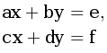

# J. Система линейных уравнений - 2
|
:---|---:
Ограничение времени	|1 секунда
Ограничение памяти	|64Mb
Ввод	|стандартный ввод или input.txt
Вывод	|стандартный вывод или output.txt

Даны числа _a, b, c, d, e, f_. Решите систему линейных уравнений

## Формат ввода
Вводятся 6 вещественных чисел - коэффициенты уравнений.

## Формат вывода
Вывод программы зависит от вида решения этой системы. Если система не имеет решений, то программа должна вывести единственное число _0_. 
Если система имеет бесконечно много решений, каждое из которых имеет вид _y=kx+b_, то программа должна вывести число _1_, а затем значения __k__ и __b__. 
Если система имеет единственное решение (_x_0,y_0_), то программа должна вывести число _2_, а затем значения _x_0_ и _y_0_. 
Если система имеет бесконечно много решений вида _x=x_0_, _y_ — любое, то программа должна вывести число _3_, а затем значение _x_0_. 
Если система имеет бесконечно много решений вида _y=y0_, _x_ — любое, то программа должна вывести число _4_, а затем значение _y_0_. 
Если любая пара чисел (_x,y_) является решением, то программа должна вывести число _5_.

Числа _x_0_ и _y_0_ будут проверяться с точностью до пяти знаков после точки.

### Пример 1
Ввод	|Вывод
:---|---:
1|2 3 3
0|
0|
1|
3|
3|

### Пример 2
Ввод	|Вывод
:---|---:
1|1 -1 1
1|
2|
2|
1|
2|

### Пример 3
Ввод	|Вывод
:---|---:
0|4 0.5
2|
0|
4|
1|
2|